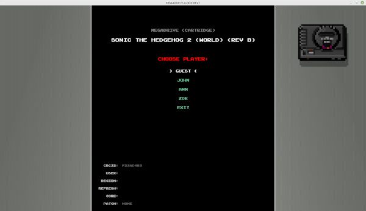

# Emulauncher

_Emulauncher_ is a simple emulator launcher GUI that allows the following
options:

  1. Per user settings and savegames
  2. Per ROM core
  3. Per ROM refresh rate
  4. Automatic patching of ROMs 
  5. Configurable theme

## Requisites

  * Retroarch installed and able to run by typing `retroarch` from the command
    line.

  * Patching utilities (only required if you plan to apply patches) installed
    and able to run from command line:
    * ppf-o-matic v3.0 (for `.ppf` patches): launched by typing `foo`
    * **xdelta3** patcher (for `.xdt` patches): launched by typing `xdelta3`.
      It's available in Linux repositories.
    * flips patcher (for `.bmp` and `.ips` patches): launched by typing `foo`

## Patch format

In order for the patches to work with EmuLauncher, they need to adhere to the
following requisites:

  1. Patch files must be in format `.ppf`, `.xdt`, `.xdelta`, `.bmp`, or `.ips`.
  2. Patch names must `be xxxxxxxx_y-z.ext` where `xxxxxxxx` is the clean CRC32
     of the ROMset it should be applied over; `y` a digit (starting from 0)
     indicating the number of the "item" it should be applied over (e.g. for
     multi disc games, it'd be the number of the disc); and `z` the number of
     the file it should be applied over (typically it will be 0, but it could be
     a different number in the case of CD images where each disc dump can
     contain multiple files). So, in most cases the patch file name would be
     something like "aaaaaaaa-0-0". **TODO:** investigate a bit further about
     multiple file ROMsets and better naming conventions for patches.
  3. It's recommended to add a `readme.txt` file containing as much information
     about the patch: What it does, who created it, when, and so on.
  4. Files above need to be compressed in `.zip` format and named
     `xxxxxxxx - description.zip` where `xxxxxxxx` stands for the clean CRC32 of
     the ROMset the patches should be applied over. It's recommended that the
     full file name just uses lowercase characters, but it's not needed.
  5. Take a look at the patch included in `test/test_data/patches` for examples. 

## Credits

As test data, Emulauncher contains the following items produced by third party
individuals/teams not related at all with Emulauncher:

  * **Console PixelArt Icons** from
    [openhandhelds.org](https://dl.openhandhelds.org/gp2x/screenshots/all290.png)
  * **Interface Sounds** from [kenney.nl](https://kenney.nl).
  * **Phantom Gear** demo ROM for Megadrive/Genesis consoles, created by [Mega
    Cat Studios](https://www.kickstarter.com/projects/megacatstudios/phantom-gear-for-the-sega-genesis-mega-drive)
  * **"Miniplanets"** ROM for Megadrive/Genesis consoles, created by
    [Sik](https://github.com/sikthehedgehog/miniplanets) and released under zLib
    License. Also, a patch to convert the classic version of the ROM to the
    remix one is provided to test patching capability.
  * Megadrive/Genesis `.dat` file has been created by
    [No-Intro](https://no-intro.org/) project.
  * **"Emulogic"** font used in the sample theme is created by
    [Freaky Fonts](https://www.urbanfonts.com/fonts-author/154/fonts.htm).
  * Patching tools: ppf-o-matic by Paradox, xdelta3 by XXX, and flips by XXX.
